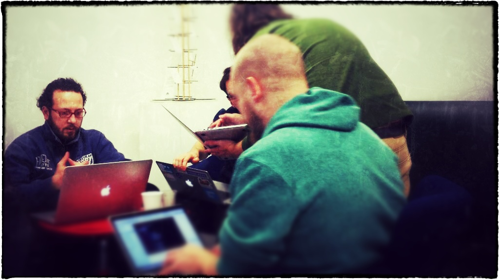
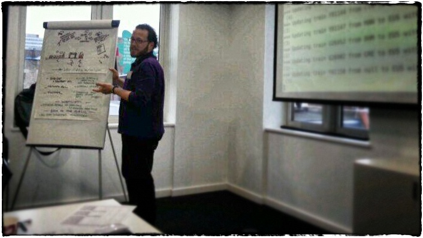

Railsponsibility
================

##Introduction

Most UK train users are unaware of their rights, e.g. to compensation after cancellations or delays. This was raised as an issues by the [Office for Rail Regulation](http://orr.gov.uk) in its ["Rail passenger compensation and refund rights" report](http://orr.gov.uk/publications/reports/rail-passenger-compensation-and-refund-rights), published on 20/2/2014.

Athough the situation is improving, [the amount of money paid out in compensation during the last surveyed year was of just by £3m](http://www.bbc.co.uk/news/business-26275394). Our early calculations estimate that **the total value of the disservice to UK passengers, calculated as the total value of the compensations they are entitled to, is in the order of £500m every year**. More can be done to make Network Rail and the rail operating companies accountable for the disservice they are responsible of. 

As much as we accept that not all incidents can be avoided, we believe that the huge amount of compensations that passengers are **not** claiming is allowing Network Rail and the operating companies to sleep over the problem, minimising intervention while keeping patting each others' backs and [awarding their directors 6-digit bonuses](http://www.bbc.co.uk/news/business-23367781).

[Some are fighting this using policy](http://www.thetimes.co.uk/tto/business/industries/transport/article3986840.ece). We believe there is one more channel we can use, that is supporting passengers to do what is in their rights and claim compensation down to the last penny.

##About *Railsponsibility*

The *Railsponsibility* project is aimed at building a system to monitor all train services being cancelled or delayed that match the criteria for compensation, to then remind the passengers who were affected of the disservice they were affected by and support them in filing the claim, automating as much as possible the process.

As of today, Raisponsibility can receive requests of monitoring delayed trains by using Twitter and by specifying the stations by using their three-letter codes, e.g. 'EUS' for London Euston (also called the CRS code). Railsponsibility will tweet back in any case at the train's arrival, whatever the delay, even if it is not sufficient to entitle you to compensation. Cancellations are not yet monitored.

To use Railsponsibility, tweet as in the following example. Imagine you are on the train from Berkhamsted (BKM) to London Euston (EUS), scheduled to leave Berkhamsted at 7:32. At some point, you realise that the train is delayed and you want Railsponsibility to monitor that for you. You will tweet: 
    
    @railspo from bkm to eus 732

Almost immediately, you will receive an acknowledgement, saying:

	@your_twitter_handle thank you for using Railsponsibility, we will tweet back when your train has arrived at EUS dico.im/railspo

Sometime later, after the train arrival, you will receive another tweet, saying:

	@your_twitter_handle your train leaving from BKM to EUS at 7:32 has arrived 5 minutes late, at 8:10

If you don't know your stations' CRS codes, look them up [here](http://www.railwaycodes.org.uk/CRS/CRSa.shtm). Sometime soon Railsponsibility will be able to interpret your tweets and understand the stations' full names if you use them.

###It's broken, what should I do?

First check the known issues [on the project's GitHub page](https://github.com/Digital-Contraptions-Imaginarium/railsponsibility/issues?state=open). If you can't find anything that applies to you, add a new issue, or, alternatively, write to railspo@dico.im. 

##A bit of history

###International Open Data Day 2014

The first brainstorming and prototyping work was developed for the London Open Data Dat 2014 hackfest. You can read the [team's original notes](https://docs.google.com/document/d/1frKRTsy6c4qe-JpwDcY0vNHjUoS9ebc_eZT5LfzJDmM/edit?usp=sharing) and [view the outcome](International-Open-Data-Day-2014/).

Among the contributors were:

- Andy Lulham ([andylolz](https://github.com/andylolz))
- Gianfranco Cecconi ([giacecco](https://github.com/giacecco))
- Matias Piipari ([mz2](https://github.com/mz2))
- Thomas Down ([dasmoth](https://github.com/dasmoth))

... and others who did not leave their contacts! :-( In the picture are, from left to right, giacecco, andylolz, mz2 and, standing, dasmoth. Sorry we don't have a better one.

###Joint Open Data Hackathon

Railsponsibility went on to win the [UK Cabinet Office](https://www.gov.uk/government/organisations/cabinet-office), [Stride](http://www.stride-project.com/) and [Network Rail](http://www.networkrail.co.uk/)'s "Joint Open Data hackathon" on 18 March 2014, as the best smart transport applications using data available from the sponsors' open data sources.

###Today

The project awoke again on 31/3/14 for additional development by Giacecco focusing exclusively on gathering train arrival data (not only delayed trains). The software has been re-written from the ground-up to be production- rather than hackathon-quality. He also migrated from Stride to [Transport API](http://transportapi.com/) first and then directly to Network Rail's ["Data Feed" service](https://datafeeds.networkrail.co.uk/ntrod/login), as there is no reason to add more points of failure to the already long chain between the source data and the software. 

##Licence

The trains schedule and arrival data are sourced from the [Network Rail "Data Feeds" service](https://datafeeds.networkrail.co.uk). As a result, Railsponsibility _contains information of Network Rail Infrastructure Limited licensed under the following licence [http://www.networkrail.co.uk/data-feeds/terms-and-conditions/](http://www.networkrail.co.uk/data-feeds/terms-and-conditions/)_.

The train operating companies' "business", "numeric" and ATOC codes are sourced from the documentation for the above: the [Network Rail Open Data wiki](http://nrodwiki.rockshore.net/index.php/Main_Page), whose content is licensed under [Creative Commons Attribution-ShareAlike 3.0 Unported](http://creativecommons.org/licenses/by-sa/3.0/).

The stations' CRS, NLC, TIPLOC and STANOX codes are sourced from the ["Railway Codes and other data"](http://www.railwaycodes.org.uk/) website by Phil Davies. We have contacted him to verify the licensing for the data, that appears to be collated from OGL-ed sources. 

 This work, but for what is specified differently above, is licensed under a [Creative Commons Attribution-ShareAlike 3.0 Unported](http://creativecommons.org/licenses/by-sa/3.0/). 

The team picture at the International Open Data Day was taken by [@raimondiand](https://twitter.com/raimondiand/status/437232231367843840), the one at the Joint Open Data Hackathon was taken by [@eehcnas](https://twitter.com/eehcnas/status/445972723614117888). Both were enhanced a little by giacecco. 
